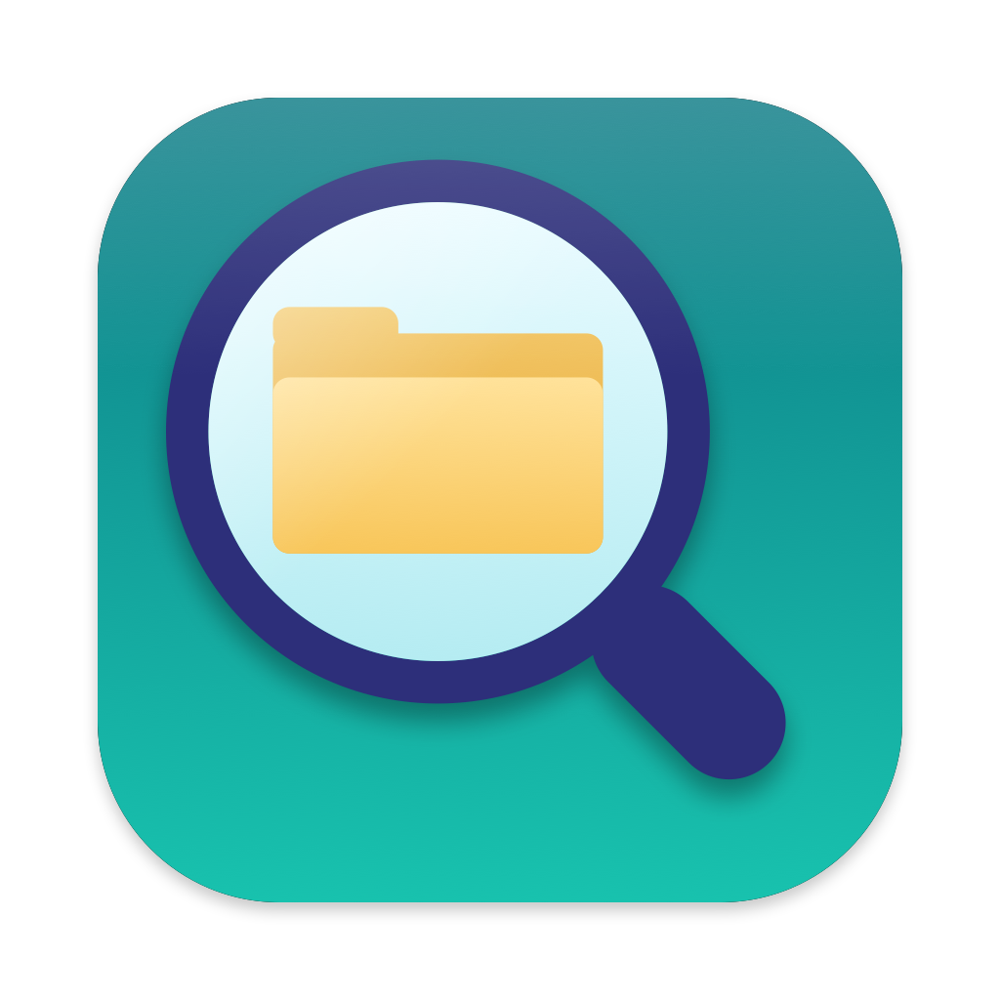
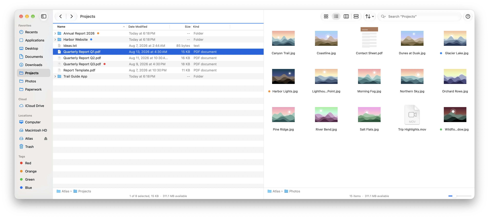
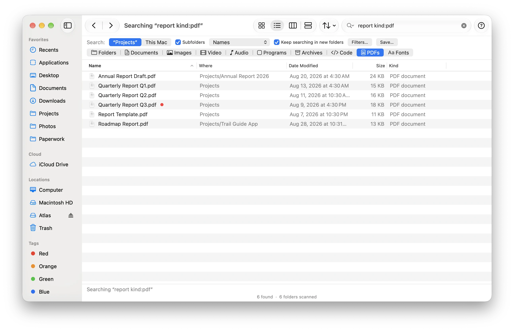
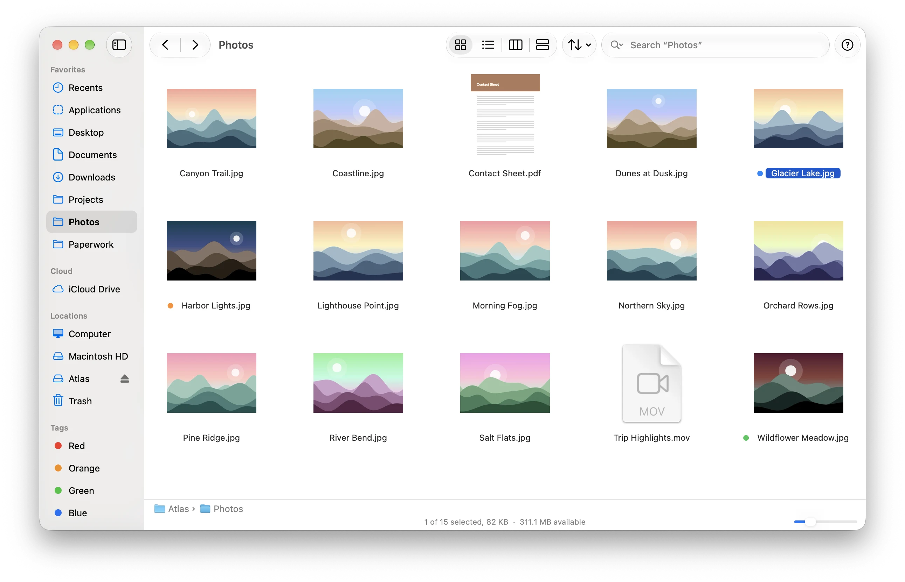
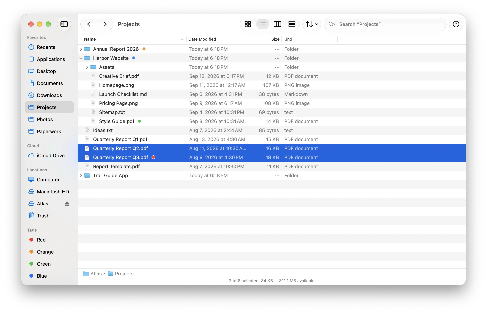
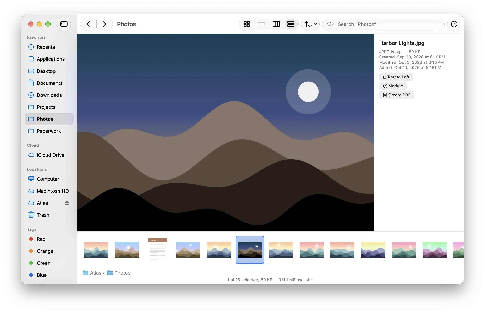
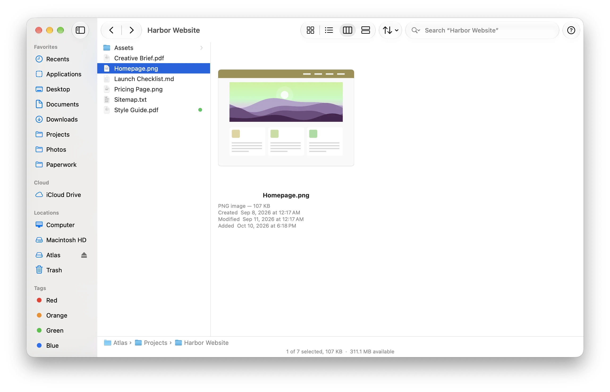

<p align="center"></p>

# Foray

A file browser for macOS that does what Finder does, minus the parts that get in the way.

<p align="center">
  <picture>
    <source media="(prefers-color-scheme: dark)" srcset="Screenshots/4-two-panes-dark.webp">
    
  </picture>
</p>

- **Search starts where you are.** ⌘F searches the current folder and its subfolders, by name, not the whole Mac by contents. Filter with plain words: `kind:images size:>5MB modified:<7d`. Finds files Spotlight hasn't indexed, too.
- **Sort order survives view changes.** Icon, list, column and gallery views share one sort, so switching views never reshuffles your files.
- **Search by kind:** documents, images, video, audio, programs, archives, code, PDFs, fonts.
- **Everything else you use Finder for:** tabs, sidebar, Quick Look, tags, Get Info, copy and move with undo, Trash with Put Back, aliases, compress, smart folders, iCloud Drive and Dropbox-style folders, network servers, AirDrop and Share.
- **Plus:** batch rename with regular expressions and a preview, Recents, an Inspector, folder sizes in list view, `foray://` links, and a built-in guide (⌘?).
- **Two panes** (⌘U): two folders side by side in one window, with F5 and F6 to copy or move between them.
- **Scriptable:** a `foray` command for Terminal (`foray search report kind:pdf`), Shortcuts actions, and an AppleScript dictionary.

Out of the box Foray runs alongside Finder and changes no system settings. Two switches in Settings, both off until you turn them on, go further: **Use Foray instead of Finder** (Foray shows the desktop and opens folders from other apps) and **administrator access** (a small helper so that changes in places like `/Library` ask for an administrator's password, as they do in Finder, instead of failing). Turning either off puts things back.

## Screenshots

Search that starts in the folder you're in, with kinds one click away:

<p align="center">
  <picture>
    <source media="(prefers-color-scheme: dark)" srcset="Screenshots/3-search-dark.webp">
    
  </picture>
</p>

Icon, list, column and gallery views share one sort order:

<p align="center">
  <picture>
    <source media="(prefers-color-scheme: dark)" srcset="Screenshots/1-icons-dark.webp">
    
  </picture>
</p>
<p align="center">
  <picture>
    <source media="(prefers-color-scheme: dark)" srcset="Screenshots/2-list-dark.webp">
    
  </picture>
</p>
<p align="center">
  <picture>
    <source media="(prefers-color-scheme: dark)" srcset="Screenshots/5-gallery-dark.webp">
    
  </picture>
</p>
<p align="center">
  <picture>
    <source media="(prefers-color-scheme: dark)" srcset="Screenshots/6-columns-dark.webp">
    
  </picture>
</p>

The files in these pictures are invented; `scripts/screenshots.sh` makes them.

## Install

With [Homebrew](https://brew.sh):

```sh
brew install --cask emkey1/tap/foray
```

Or by hand:

1. Download `Foray-x.y.z.dmg` from the [latest release](https://github.com/emkey1/Foray/releases/latest).
2. Open it and drag **Foray** to **Applications**.
3. Open Foray. macOS asks before it can see Desktop, Documents, Downloads and external drives; allow those. For the Trash, Mail data and other protected places, add Foray in **System Settings › Privacy & Security › Full Disk Access** (Foray › Settings › Privacy has a button for it).

Requires macOS 26 or later (Apple silicon or Intel). From 0.9.1 on, Foray offers new versions itself (Foray › Check for Updates…); if you have 0.9.0, download the latest release once.

## Build from source

Requires Xcode 27 (Swift 6.4).

```sh
scripts/bundle.sh release && open ".build/Foray Dev.app"   # build and run a test copy
swift test                                                  # run the tests
```

Test builds are a separate app, **Foray Dev** (its own bundle ID, settings and privacy grants, and a DEV badge on the icon), so they never get mixed up with an installed Foray. They're signed with your Apple Development certificate when you have one, which keeps permissions like Full Disk Access across rebuilds.

Releases are built from `Xcode/Foray.xcodeproj` (scheme "Foray App"): Product › Archive, then Distribute App › Direct Distribution signs with Developer ID and notarizes. Then `scripts/make-dmg.sh` exports the notarized app from the newest archive and makes the installer: a window with Foray and an Applications shortcut over a background that explains what to do (`scripts/dmg-layout.swift` writes the window layout directly, so Finder isn't scripted). After publishing the GitHub release, `scripts/update-cask.sh` points the Homebrew cask ([emkey1/homebrew-tap](https://github.com/emkey1/homebrew-tap)) at it.

The app bundle also carries the `foray` command-line tool and the privileged helper (`Contents/Helpers`), built from `Sources/foray-cli` and `Sources/foray-helper`. The helper is a root launchd daemon that macOS learns about only when the user turns on administrator access; `Sources/RFOperations/Privileged.swift` lists the handful of file operations it will do, and `PrivilegedHelper.swift` how callers are checked (Foray's code signature, plus an administrator's authorization for each job).

`DESIGN.md` describes the architecture, and the in-app guide (`Sources/RFUI/Guide/guide.html`) describes every feature.

## License

MIT. See [LICENSE](LICENSE).

Foray is an independent project and is not affiliated with or endorsed by Apple. Finder is a trademark of Apple Inc.
